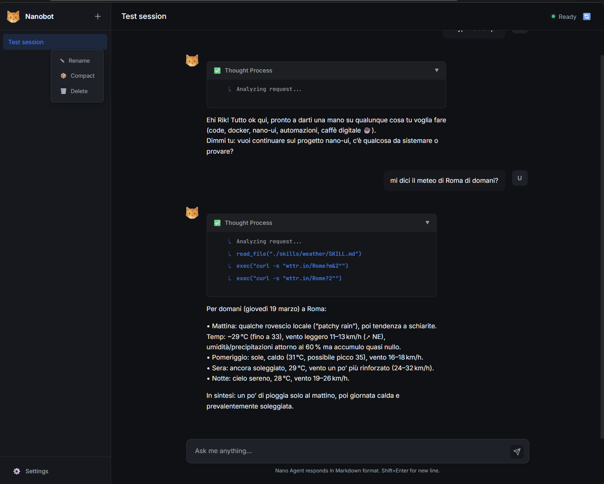
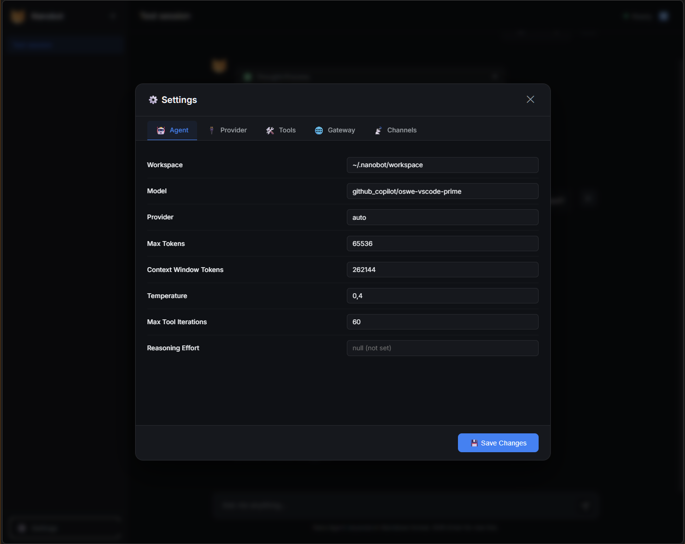

# 🐈 Nano-UI

**Nano-UI** is a modern, lightweight web interface that makes it easy to talk to [nanobot](https://github.com/HKUDS/nanobot) from your browser.

It includes:

- **Streaming responses (SSE)** with gradual updates + reasoning steps.
- **Session management** (create/load/delete/compact conversations).
- **Persistent history** in `.jsonl` (and optional export to `HISTORY.md`).
- **Settings UI** for configuring `config.json` without manual edits.
- **Telegram bridge** (optional webhook) to chat with nanobot from Telegram.

---

## 📸 Screenshots

### Chat UI



### Settings panel



---

## 🚀 Quick Start (Docker Compose)

Nano-UI is designed to run alongside a nanobot container. The UI communicates with nanobot by running commands inside the nanobot container (via Docker socket), so no network port is required between the two.

### 1) Prerequisites

- nanobot directory (commonly `~/.nanobot`)

### 2) Configure environment variables

Copy the example env file:

```bash
cp .env.example .env
```

Edit `.env` and set:

- `NANOBOT_CONFIG_PATH` — path to your `config.json` on the host.
- `NANOBOT_SESSIONS_DIR` — path to your nanobot session folder on the host.

### 3) Docker Compose example (nano-ui)

A simple docker-compose setup for Nano-UI. Nano-UI communicates with nanobot by using the Docker socket (`docker exec`), so the nanobot service can run separately (or be managed however you prefer).

```yaml

services:
  nano-ui:
    build: .  # path to this repo
    container_name: nano-ui
    ports:
      - "50002:50002"  # Nano-UI web UI
    volumes:
      - ${NANOBOT_CONFIG_PATH:-./config.json}:/app/config.json
      - ${NANOBOT_SESSIONS_DIR:-./sessions}:/app/sessions
      - /var/run/docker.sock:/var/run/docker.sock
```


### 4) Launch

```bash
docker compose up -d --build
```

Then open:

- **Nano-UI**: `http://localhost:50002`

---

## 🧠 Telegram Bridge

Nano-UI can act as a lightweight Telegram webhook proxy: it receives incoming updates, invokes nanobot, and replies back to Telegram.

> ⚠️ **Important:** The Telegram bridge is powered by nanobot's built-in `channels.telegram` configuration. You must configure `channels.telegram` in your **nanobot `config.json`** for the bridge to work.

### 1) Configure `config.json`

Add or update the `channels.telegram` section in your nanobot `config.json`:

```json
{
  "channels": {
    "telegram": {
      "enabled": true,
      "token": "123456:ABC-your-token-here",
      "allowFrom": ["123456789"]
    }
  }
}
```

- `token`: your bot token from [@BotFather](https://t.me/BotFather).
- `allowFrom`: optional list of allowed chat IDs (leave empty to allow all).

Nano-UI reads these settings live on every webhook request — so you can update `config.json` or use the Settings panel without restarting.

## 🧩 Developer / Local Run

To run Nano-UI locally without Docker:

```bash
pip install -r requirements.txt
python server.py --port 50002
```

Then open: `http://localhost:50002`

> Note: the local run still expects to talk to nanobot via Docker (docker exec), so Docker must be available.

---

## 📂 Project Structure

- `server.py` — lightweight HTTP server exposing `/api/v1/agent`, sessions, config endpoints, and Telegram webhook.
- `app.js` — frontend logic (chat UI, streaming SSE, session management).
- `settings.js` — settings panel UI + config.json editor.
- `index.html` / `style.css` — layout and styling.

---

## 🙏 Credits

- **nanobot** by [HKUDS](https://github.com/HKUDS/nanobot)

---

*Built with ❤️ for the Nanobot ecosystem.*
